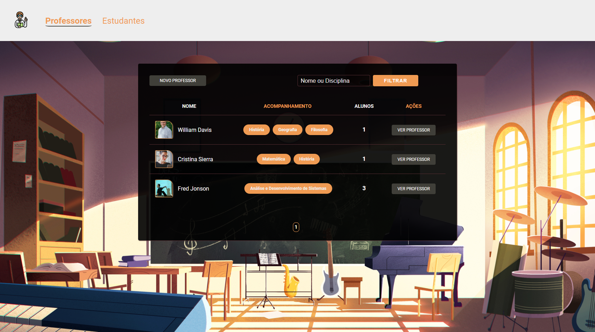
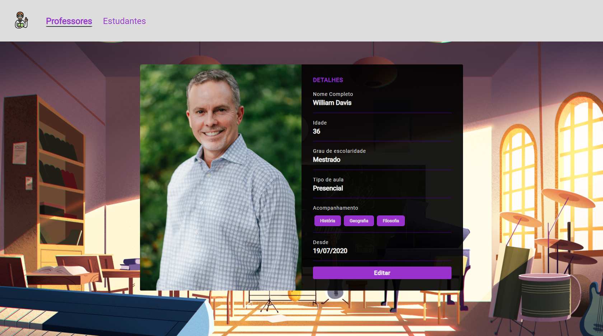
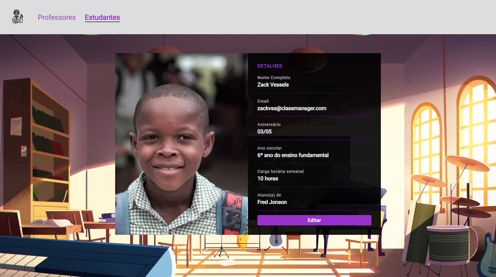

<h1 align="center">
    
</h1>

## 📌 Índice dos desafios 🏆

**Criando aplicação** 📝

- [x] [4-1: Header](#desafio-4-1-header-)
- [x] [4-2: Card do Professor](#desafio-4-2-card-do-professor-)
- [x] [4-3: Formulário e Rota de cadastro do Professor](#desafio-4-3-formulário-e-rota-de-cadastro-do-professor-)
- [x] [4-4: Apresentação, edição e formatação dos dados de um professor](#desafio-4-4-apresentação-edição-e-formatação-dos-dados-de-um-professor-)
- [x] [4-5: HTTP: PUT e DELETE](#desafio-4-5-http-put-e-delete-)
- [x] [4-6: Listagem de professores](#desafio-4-6-listagem-de-professores-)
- [x] [4-7: Estruturando estudantes](#desafio-4-7-estruturando-estudantes-)

**Persistindo dados** 📁

- [x] [5-1: Refatorando aplicação e configurando o BD](#desafio-5-1-refatorando-aplicação-e-configurando-o-bd-)
- [x] [5-2: Interagindo com o BD](#desafio-5-2-interagindo-com-o-bd-)
- [x] [5-3: Relacionamentos e filtros no BD](#desafio-5-3-relacionamentos-e-filtros-no-bd-)
- [x] [5-4: Paginação de resultados no BD](#desafio-5-4-paginação-de-resultados-no-bd-)
  
## 🚀 Tecnologias utilizadas 

Os desafios foram feitos usando as seguintes tecnologias

### 🔧 Ferramentas

- [x] [JavaScript](https://developer.mozilla.org/pt-BR/docs/Web/JavaScript)
- [x] [Node.js](https://nodejs.org/en/)
- [x] [Nunjucks](https://mozilla.github.io/nunjucks/)
- [x] [PostgreSQL](https://www.postgresql.org/)

### 📕 Bibliotecas

- [x] [Browsersync](https://www.browsersync.io/)
- [x] [npm-run-all](https://www.npmjs.com/package/npm-run-all)
- [x] [File System | Node.js](https://nodejs.org/api/fs.html)
- [x] [method-override](https://www.npmjs.com/package/method-override)
- [x] [node-postgres](https://www.npmjs.com/package/pg) 

### 🌉 API

- [x] [Unsplash Source](https://source.unsplash.com/)

## Desafio 4-1: Header ✅ 

## 🔖 Atividades 

Esse é o primeiro desafio da sequência de criação de um site de aulas particulares. A ideia é que você aplique, em pequenas doses, os conhecimentos aprendidos nas aulas. Nessa primeira etapa, você deve criar um header com dois links: Teachers e Students (aproveite a estrutura criada no módulo 03)

## 📚 Conceitos estudados

- **Rotas**
- **Menu**
- **Alinhamento**
- **Hover**
- **CSS Transition**

---

## Desafio 4-2: Card do Professor ✅ 

## 🔖 Atividades 

Nessa etapa você de utilizar o browser-sync e criar um card para apresentação das informações do professor.

## 📚 Conceitos estudados

- **Libs**
- **CSS Grid**
- **CSS Animation**
- **Pseudo-classes**
- **Box-shadow**

---

## Desafio 4-3: Formulário e Rota de cadastro do Professor ✅ 

## 🔖 Atividades

Nessa etapa você deve criar um formulário de cadastro do professor e uma rota do tipo post que irá realizar as validações e salvar os dados enviados.

## 📚 Conceitos estudados

- **Forms**
- **Rotas**
- **Validação no Back end**
- **JavaScript Constructors**
- **JSON**
- **Método writeFile do Node fs**

---

## Desafio 4-4: Apresentação, edição e formatação dos dados de um professor ✅ 

## 🔖 Atividades

Nessa etapa você deve criar duas rotas: uma para apresentar os dados do professor (show) e outra para a edição dos dados cadastrados (edit). Além disso, realize a formatação dos dados cadastrados para a correta exibição no HTML

## 📚 Conceitos estudados

- **Formatação de dados (Intl, Split)**
- **Rotas**
- **Separar as funções das Rotas (exports)**
- **Nunjucks  (Reaproveitamento de Form)**
- **JavaScript Date**

---

## Desafio 4-5: HTTP: PUT e DELETE ✅ 

## 🔖 Atividades

Nessa etapa você irá implementar duas rotas: PUT e DELETE para a atualização e remoção, respectivamente, dos dados cadastrados de um professor.

## 📚 Conceitos estudados

- **Verbos HTTP**
- **Funções de iteração**
- **Sobrescrever métodos**

---

## Desafio 4-6: Listagem de professores ✅ 

## 🔖 Atividades

Nessa etapa você deve listar todos os professores salvos no arquivo json e apresentá-los em formato de tabela.

## 📚 Conceitos estudados

- **Rotas**
- **HTML Table**
- **Span**
- **Estilização de tabela**

---

## Desafio 4-7: Estruturando estudantes ✅ 

## 🔖 Atividades

Nessa etapa você deve reaproveitar para os estudantes toda a estrutura já criada para os professores. Além disso, deve implementar a lógica do menu ativo.

## 📚 Conceitos estudados

- **Estrutura de projeto**
- **Manipulação da DOM**
- **Formatação de dados**

---

## Desafio 5-1: Refatorando aplicação e configurando o BD ✅ 

## 🔖 Atividades

Esse é o primeiro desafio de uma sequência que irá implementar o banco de dados na aplicação desenvolvida no módulo anterior. 

Nessa etapa, você deve refatorar o código da sua aplicação e preparar o seu ambiente para trabalhar com banco de dados.

## 📚 Conceitos estudados

- **Queries básicas**
- **Estrutura de pastas**
- **Configuração PostgreSQL**

---

## Desafio 5-2: Interagindo com o BD ✅ 

Nessa etapa, você deve refatorar os CRUDs dos professores e estudantes para que eles utilizem o banco de dados.

## 📚 Conceitos estudados

- **INSERT, SELECT, UPDATE, DELETE**
- **ORDER BY**
- **Criação de Models**

---

## Desafio 5-3: Relacionamentos e filtros no BD ✅ 

## 🔖 Atividades

Nessa etapa, você deve criar um relacionamento entre o professor e o estudante. Além disso, deve-se implementar filtros na listagem da tabela de professores.

## 📚 Conceitos estudados

- **Relacionamentos**
- **Filtros**
- **Query params**
- **ILIKE**

---
## Desafio 5-4: Paginação de resultados no BD ✅ 

## 🔖 Atividades

Nessa etapa, você deve implementar a lógica de paginação dos resultados do BD.

## 📚 Conceitos estudados

- **LIMIT / OFFSET**
- **Lógica de programação**
- **Subquery**
- **JavaScript para renderizar o HTML**

---

<h1 align="center"> Resultados finais 📷 </h1>

**Tabela 👨‍🏫👩‍🏫**

**Card do professor 🎴**

**Card do estudante 🃏**

---

# 📜 Licença 

Realizado em 2020. Esse projeto está sob a [licença MIT](/LICENSE).

## Feito com 💚 por Leonardo Campello