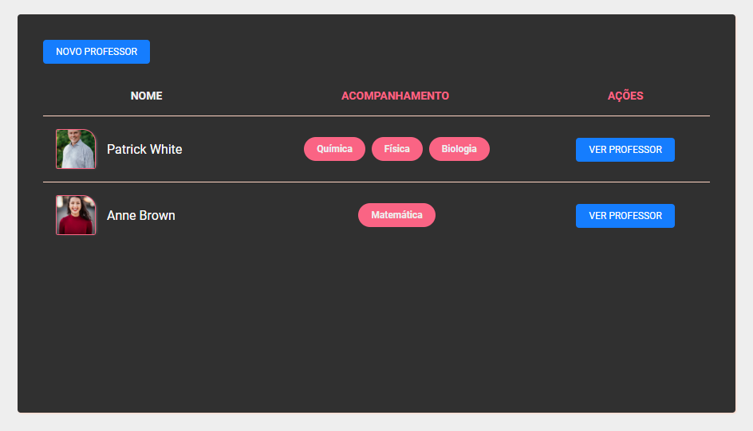
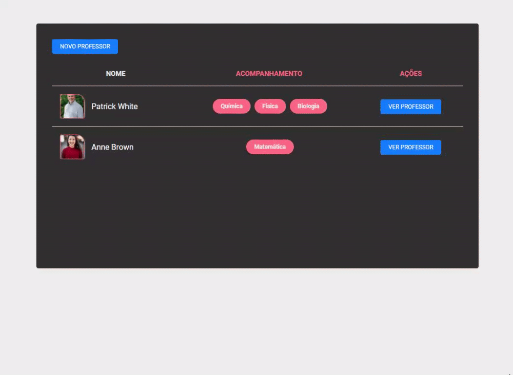
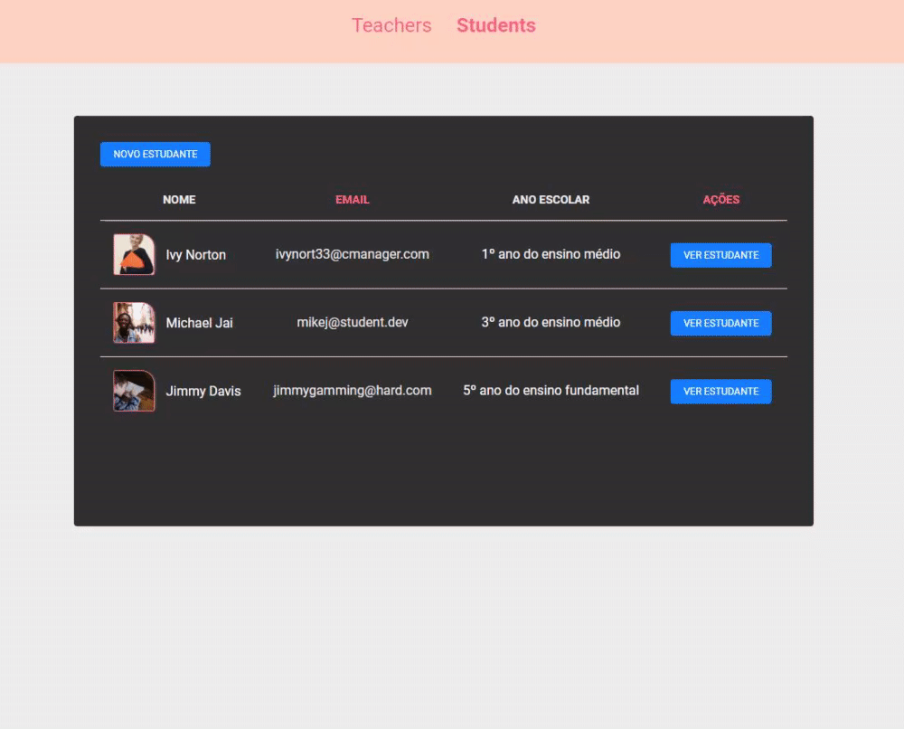

<h1 align="center">
    
</h1>

# 🚀 Tecnologias utilizadas 

Os desafios foram feitos usando as seguintes tecnologias

### 🔧 Ferramentas

- [x] [JavaScript](https://developer.mozilla.org/pt-BR/docs/Web/JavaScript)
- [x] [Node.js](https://nodejs.org/en/)
- [x] [Nunjucks](https://mozilla.github.io/nunjucks/)
- [x] [HTML5](https://developer.mozilla.org/pt-BR/docs/Web/HTML/HTML5)
- [x] [CSS](https://developer.mozilla.org/pt-BR/docs/Web/CSS)   

### 📕 Libraries

- [x] [Browsersync](https://www.browsersync.io/)
- [x] [npm-run-all](https://www.npmjs.com/package/npm-run-all)
- [x] [File System | Node.js](https://nodejs.org/api/fs.html)
- [x] [method-override](https://www.npmjs.com/package/method-override)

### 🌉 API

- [x] [Unsplash Source](https://source.unsplash.com/)

# Desafio 4-1: Header ✅

## 🔖 Atividades 

Esse é o primeiro desafio da sequência de criação de um site de aulas particulares. A ideia é que você aplique, em pequenas doses, os conhecimentos aprendidos nas aulas. Nessa primeira etapa, você deve criar um header com dois links: Teachers e Students (aproveite a estrutura criada no módulo 03)

## 📚 Conceitos estudados

- **Rotas**
- **Menu**
- **Alinhamento**
- **Hover**
- **CSS Transition**

## 🙋‍♂️ Resultados 

---

# Desafio 4-2: Card do Professor ✅

## 🔖 Atividades 

Nessa etapa você de utilizar o browser-sync e criar um card para apresentação das informações do professor.

## 📚 Conceitos estudados

- **Libs**
- **CSS Grid**
- **CSS Animation**
- **Pseudo-classes**
- **Box-shadow**

## 🙋‍♂️ Resultados

---

# Desafio 4-3: Formulário e Rota de cadastro do Professor ✅

## 🔖 Atividades

Nessa etapa você deve criar um formulário de cadastro do professor e uma rota do tipo post que irá realizar as validações e salvar os dados enviados.

## 📚 Conceitos estudados

- **Forms**
- **Rotas**
- **Validação no Back end**
- **JavaScript Constructors**
- **JSON**
- **Método writeFile do Node fs**

## 🙋‍♂️ Resultados

---
**Form**

---

# Desafio 4-4: Apresentação, edição e formatação dos dados de um professor ✅

## 🔖 Atividades

Nessa etapa você deve criar duas rotas: uma para apresentar os dados do professor (show) e outra para a edição dos dados cadastrados (edit). Além disso, realize a formatação dos dados cadastrados para a correta exibição no HTML

## 📚 Conceitos estudados

- **Formatação de dados (Intl, Split)**
- **Rotas**
- **Separar as funções das Rotas (exports)**
- **Nunjucks  (Reaproveitamento de Form)**
- **JavaScript Date**

## 🙋‍♂️ Resultados 

---

**Estrutura de pastas**

---

# Desafio 4-5: HTTP: PUT e DELETE ✅

## 🔖 Atividades

Nessa etapa você irá implementar duas rotas: PUT e DELETE para a atualização e remoção, respectivamente, dos dados cadastrados de um professor.

## 📚 Conceitos estudados

- **Verbos HTTP**
- **Funções de iteração**
- **Sobrescrever métodos**

## 🙋‍♂️ Resultados 

**Rota PUT**

---

**Rota DELETE**

---

# Desafio 4-6: Listagem de professores ✅

## 🔖 Atividades

Nessa etapa você deve listar todos os professores salvos no arquivo json e apresentá-los em formato de tabela.

## 📚 Conceitos estudados

- **Rotas**
- **HTML Table**
- **Span**
- **Estilização de tabela**

## 🙋‍♂️ Resultados 

**Listagem de professores**

---

**Funcionamento**

---

# Desafio 4-7: Estruturando estudantes ✅

## 🔖 Atividades

Nessa etapa você deve reaproveitar para os estudantes toda a estrutura já criada para os professores. Além disso, deve implementar a lógica do menu ativo.

## 📚 Conceitos estudados

- **Estrutura de projeto**
- **Manipulação da DOM**
- **Formatação de dados**

## 🙋‍♂️ Resultados 

---

# 📜 Licença 

Realizado em 2020. Esse projeto está sob a [licença MIT](/LICENSE).

## Feito com 💚 por Leonardo Campello